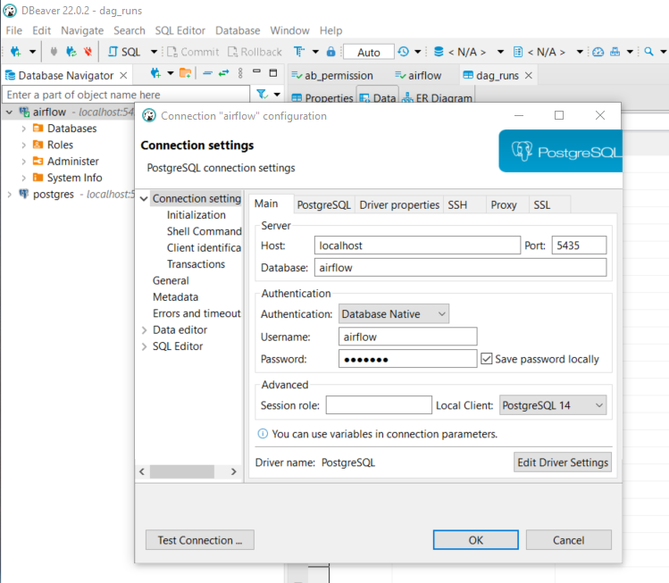
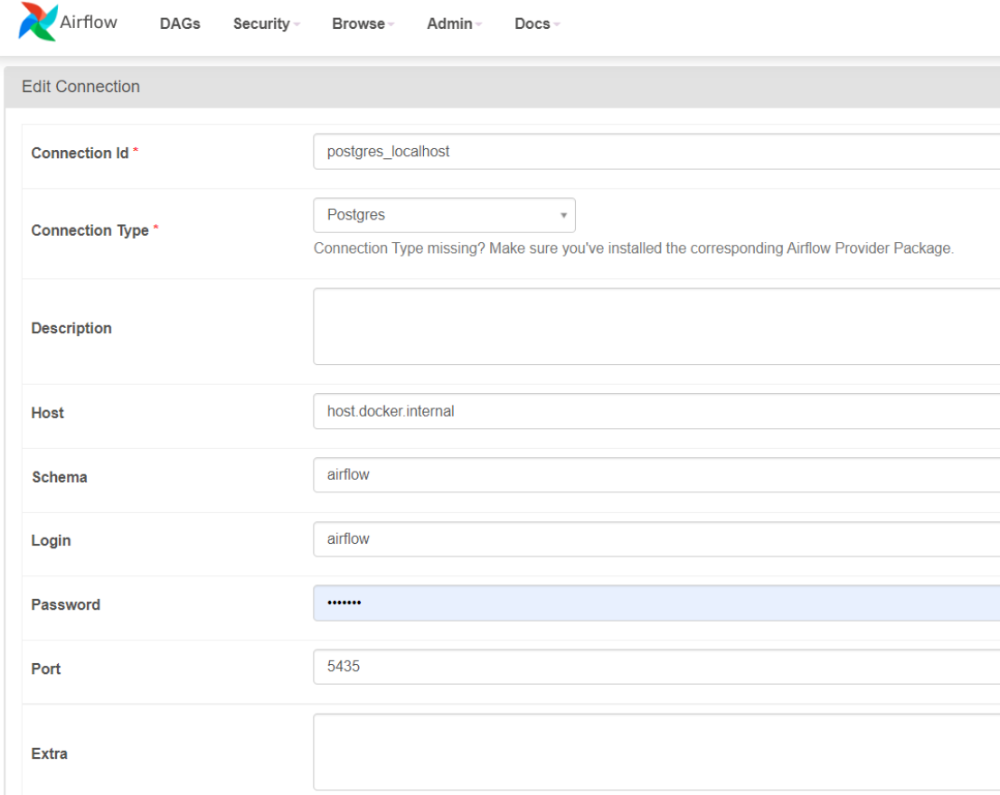

# APACHE AIRFLOW DOCKER

This docker needs more than 4 GB RAM.

This project follows some tutorials:
- [Deploy Airflow in Docker](https://www.youtube.com/watch?v=aTaytcxy2Ck&ab_channel=DatawithMarc)
- [Create a DAG](https://www.youtube.com/watch?v=IH1-0hwFZRQ&ab_channel=DatawithMarc)
- [Connect with Postgres DB](https://www.youtube.com/watch?v=S1eapG6gjLU&ab_channel=coder2j)

Here a summary of instructions:

1. Create folders:  mkdir ./dags ./plugins ./logs 
2. Create .env file to give permissions: echo -e "AIRFLOW_UID=$(id -u) \nAIRFLOW_GID=0" > .env
3. Run the docker container: docker-compose up airflow-init
4. Once the airflow user was created then run: docker-compose up

## In case you want to connect to the Postgresql DB:

**Credentials:** user: `airflow`, pass: `airflow`

1. Check which port is open for the postgres service. [Click here:](https://github.com/Borreguin/ApacheAirflow/blob/52b468a589f013c1c63ad6589770c72c9db99bb8/docker-compose.yaml#L93)
2. Test the connection using any DB Manager: 

3. In AirFlow create the connection as follows:

## To configure for sending emails:

1. Search section `[smtp]` in file [airflow.cfg](config/airflow.cfg)
2. Fill this section according this [explanation](https://naiveskill.com/send-email-from-airflow/) 
3. Allow your account send emails: [Enable IMAP for your account](https://hevodata.com/learn/airflow-emailoperator/)